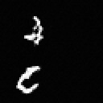
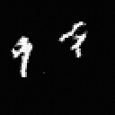
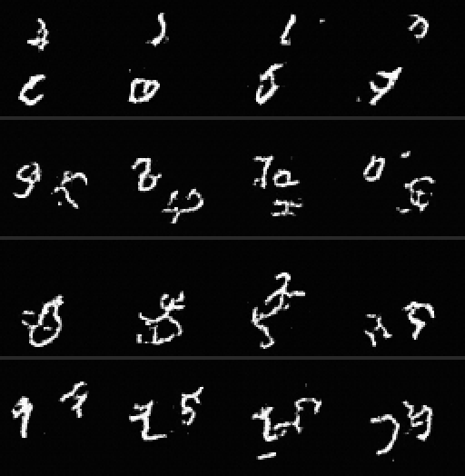
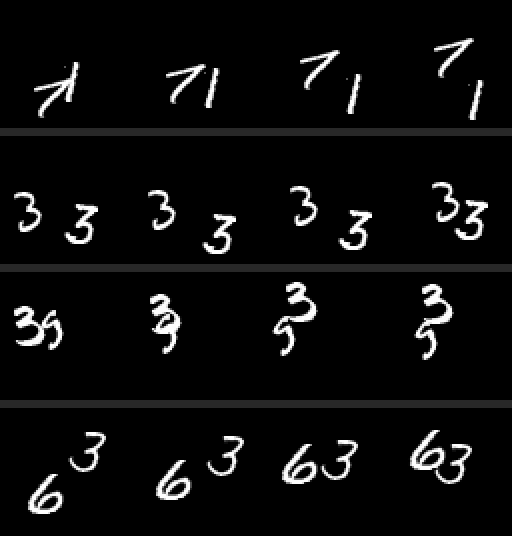

# rahulk-flow-video

[](https://python.org)
[](https://pytorch.org)
[](LICENSE)

A **flow-matching video model built from scratch** in PyTorch — no `diffusers`, no pretrained weights, just math → code → results. A 17.5M-param factorized spatiotemporal DiT (**DiTVideo**) trained **unconditionally, in pixel space,** on Moving MNIST (8 frames, 64×64 grayscale). The video sibling of [rahulk-ddpm](https://github.com/rahulkhunte/rahulk-ddpm): same transformer/AdaLN machinery, two genuinely new pieces on top — **velocity-target flow matching** instead of ε-prediction, and **factorized temporal attention** for frame-to-frame coherence.

> **Honest framing.** This is a from-scratch learning-and-research repo, not a product. The goal of the run was *coherent temporal motion at small scale* — and that goal is met. Sample legibility is at the level you'd expect from 17.5M unconditional params at 50k steps; the known levers to push it further are listed at the bottom, not hidden.

---

## Results

Trained 50,000 steps on a single free Kaggle T4 (~4.6 h). Velocity-MSE loss: **1.97 → 0.044**.

**Generated from pure noise** (EMA weights, 50 Euler steps):

| Generated clip 0 | Generated clip 1 |
|:----------------:|:----------------:|
|  |  |

Contact sheet — each **row is one generated clip**, columns are frames over time (read left → right for motion):



For reference, **ground-truth training data** in the same layout (these are dataset samples, **not** model output):



**What the run demonstrates:**

- **Coherent temporal motion — the temporal attention works.** Each stroke slides and deforms *smoothly* across the 8 frames: no per-frame flicker, no teleporting, no identity swaps mid-clip. The model behaves like a video model, not 8 independent image models sharing weights.
- **Clean bimodal output.** Crisp white strokes on true black — the ODE lands on the data distribution's support (final sample range [-1.08, 1.13] vs data [-1, 1]), with none of the gray haze of an under-integrated sampler.
- **The honest caveat: digits are semi-legible.** Some clips read clearly (9, 5, 0, 2); many are digit-*like* strokes rather than crisp numerals. That is the expected ceiling for a 17.5M-param **unconditional** model at 50k steps with plain Euler-50 sampling — compare the ground-truth sheet above to see the gap. It is a capacity/conditioning ceiling, not a training failure (see [levers](#next-steps--known-levers)).

---

## Method — what makes this not-a-DDPM

Two deliberate departures from `rahulk-ddpm`. Everything else (sinusoidal time embedding, AdaLN DiT blocks, EMA at inference, Adam + grad-clip, resume checkpointing) carries over unchanged.

### 1 · Flow matching: predict velocity, not noise

Convention: **t = 0 is data, t = 1 is noise** (the model scales `t·1000` for the time embedding — the scheduler itself stays in [0, 1]).

```
Interpolation path:   x_t = (1 − t)·x₀ + t·x₁          x₁ ~ N(0, I)
Target velocity:      v   = dx_t/dt = x₁ − x₀           (constant along the straight path)
Training loss:        L   = E‖ v_θ(x_t, t) − (x₁ − x₀) ‖²
Sampling (ODE):       x ← x − Δt · v_θ(x, t)            Euler, t stepping 1 → 0
```

Instead of learning to *denoise* along a 1000-step stochastic chain, the network learns the **velocity field of a straight-line path** between noise and data (Lipman et al., 2023; equivalently the rectified-flow view of Liu et al., 2022). Sampling is then deterministic ODE integration — **50 Euler steps** here instead of a 1000-step reverse chain. The integrator recovers held-out x₀ to 5.7e-6 in the scheduler's unit test.

### 2 · Factorized spatial + temporal attention

Full space-time attention is O((T·N)²) — the thing that made `rahulk-ddpm`'s VideoDiT expensive. Here every DiT block pair splits it:

```
spatial:   (B, T, N, D) → (B·T, N, D)   each frame's 64 patch tokens attend to each other
temporal:  (B, T, N, D) → (B·N, T, D)   each patch position attends across the 8 frames
```

The temporal half is what buys frame coherence: a stroke at patch (3, 5) in frame 2 can directly see the same spatial position in frames 0–7, so motion is modeled as a first-class signal rather than hoped for. This is the standard factorization from video DiTs, applied at teaching scale.

---

## Architecture & repo layout

```
rahulk-flow-video/
├── scheduler/
│   └── flow_scheduler.py     # straight-line path, velocity target, Euler ODE sampler
├── model/
│   ├── time_embedding.py     # sinusoidal embedding (continuous t, scaled ×1000)
│   ├── dit_block.py          # AdaLN DiT block (reused design from rahulk-ddpm)
│   ├── temporal_attention.py # the (B,T,N,D) → (B·N,T,D) frame-axis attention
│   └── dit_video.py          # DiTVideo: patchify → [spatial+temporal]×8 → unpatchify
├── data/
│   └── moving_mnist.py       # Moving MNIST → (B, 8, 1, 64, 64) clips in [-1, 1]
├── train.py                  # velocity loss + EMA(0.9999) + resume + HF Hub sync
├── sample.py                 # Euler ODE sampling → GIF (--weights ema|raw)
├── kaggle/                   # T4 notebook + metadata (see kaggle/README.md)
├── docs/BLUEPRINT.md         # the build plan this repo follows
└── config.yaml
```

DiTVideo at the shipped config: patch 8 → 8×8 = 64 tokens/frame, dim 256, 8 spatial+temporal block pairs, 4 heads — **17.54M params**.

## Quickstart

```bash
git clone https://github.com/rahulkhunte/rahulk-flow-video.git
cd rahulk-flow-video
pip install torch numpy pyyaml pillow huggingface_hub

# one-time: fetch the standard Moving MNIST file, then build the sequence-first cache
wget -P data/MovingMNIST/ http://www.cs.toronto.edu/~nitish/unsupervised_video/mnist_test_seq.npy
python -m data.moving_mnist
python train.py                    # train (resumes from HF automatically if configured)
python sample.py --ckpt checkpoints/ema_final.pth              # sample → assets/*.gif
python sample.py --ckpt checkpoints/resume_step_5000.pth --weights raw   # eyeball early
```

With no checkpoint, `sample.py` emits pure-noise GIFs — that's the sampler smoke-test *pass*, proving shapes and rescaling survive the round trip.

> **EMA-lag gotcha** (why `--weights raw` exists): with decay 0.9999 the EMA shadow is still ~`0.9999^step` random init — ≈61% at 5k steps. So EMA samples look like noise for the first half of training while the raw weights already show structure. Eyeball **raw** early, **EMA** late; by ~35k the EMA overtakes raw and stays smoother.

## Training

| Config | Value |
|--------|-------|
| Data | Moving MNIST, 8-frame clips, 64×64 grayscale, [-1, 1] |
| Objective | velocity MSE (flow matching) |
| Model | DiTVideo, 17.54M params |
| Batch / LR | 16 / 1e-4 (Adam, grad-clip 1.0) |
| EMA decay | 0.9999 |
| Steps | 50,000 (~3.1 steps/s) |
| Sampler | Euler ODE, 50 steps |
| Hardware | **one free Kaggle T4 session, ~4.6 h** |

The infra is built so a dropped Kaggle session is a non-event:

- The prepped Moving MNIST cache is attached as a **private Kaggle Dataset** — sessions start training immediately instead of re-downloading/re-transposing.
- `train.py` **syncs checkpoints to HF Hub** on every save (`resume_latest.pth`/`ema_latest.pth` overwritten, permanent `*_step_N.pth` milestones every 10k) and **auto-resumes** from the latest HF checkpoint on startup. Weights live at [`rahulkhunte/rahulk-flow-video-ckpts`](https://huggingface.co/rahulkhunte/rahulk-flow-video-ckpts) on HF Hub — no `.pth` is ever committed to git. Token via the `HF_TOKEN` env var (Kaggle Secrets on the notebook), never hardcoded.
- The 50k run happened to finish inside one session; if it hadn't, re-running the notebook resumes from HF automatically. See [`kaggle/README.md`](kaggle/README.md) for the T4-is-UI-only gotcha and the full run procedure.

## Next steps — known levers

Framed as levers, not TODOs — each has a predictable effect on the semi-legibility caveat above:

- **Class conditioning + CFG** — the biggest legibility lever. Unconditional generation makes the model average over all 100 digit-pair combinations; conditioning on digit class (AdaLN, same slot the timestep uses) plus classifier-free guidance sharpens samples dramatically at every scale it's been tried.
- **More Euler steps at inference** — free quality, no retraining: `python sample.py --steps 200`. Diminishing returns, but 50 steps is the floor, not the ceiling.
- **More capacity / longer training** — dim 256 → 384 or depth 8 → 12 roughly doubles params and still fits a T4; the loss was still trending down at 50k.

## References

- Lipman et al. (2023). **Flow Matching for Generative Modeling.** ICLR. https://arxiv.org/abs/2210.02747
- Liu, Gong & Liu (2022). **Flow Straight and Fast: Learning to Generate and Transfer Data with Rectified Flow.** https://arxiv.org/abs/2209.03003
- Peebles & Xie (2023). **Scalable Diffusion Models with Transformers (DiT).** ICCV. https://arxiv.org/abs/2212.09748

---

**Rahul Khunte** — [github.com/rahulkhunte](https://github.com/rahulkhunte) · MIT License
